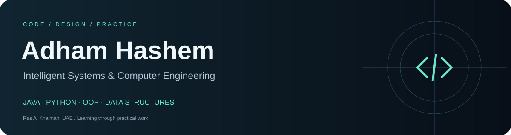
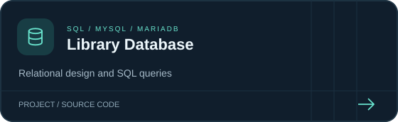
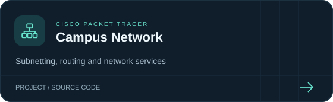

  

  
  
  

<strong>Intelligent Systems &amp; Computer Engineering</strong> Java · Python · OOP · Data Structures

## About

I'm Adham, an **Intelligent Systems & Computer Engineering student at Al-Aqsa University (2023–2028 expected)**, based in **Ras Al Khaimah, UAE**. My main focus is Java, Python, OOP and data structures. I practice web development, SQL and networking through the projects below.

Alongside my studies, I work as an **AutoCAD Draftsperson — Kitchens & Cabinets at AL IFTINAN**, preparing dimensioned 2D drawings from supplied measurements and 3D designs for workshop fabrication.

I like keeping my code clear, breaking a project into understandable parts, and learning by building something that works.

---

## Skills

| Focus | What I work with |
| --- | --- |
| **Web interfaces** | Semantic HTML, CSS layouts, responsive pages and JavaScript DOM interactions. |
| **[SQL & Databases](https://adham2005-h.github.io/portfolio/#sql-projects)** | Relational design, keys, constraints, joins and aggregate queries; MySQL and PHP/PDO. |
| **OOP** | Java and Python classes, encapsulation, inheritance and method overriding; Java interfaces and abstract classes. |
| **Data storage** | MySQL, localStorage, Java object serialization and in-memory collections. |
| **[Networking](https://adham2005-h.github.io/portfolio/#networking-projects)** | Cisco Packet Tracer, IPv4 subnetting, static routing, DHCP relay, DNS and wireless labs. |

---

## Live Web Demos

[Restaurant](https://adham2005-h.github.io/restaurant-website/) · [To-Do List](https://adham2005-h.github.io/todo-list/) · [Calculator](https://adham2005-h.github.io/javascript-calculator/)

## Selected Projects

Click a card to explore the code, setup instructions and project details.

| | |
| --- | --- |
|  |  |
|  |  |
|  |  |
|  |  |

---

## Project Notes

- **Java Library:** organized books and students into classes, used interfaces and inheritance, and saved data to a local file.
- **Python Bank:** built account operations, transfers, transaction history and console menus with input checks.
- **SQL Library Database:** designed seven related tables, added data constraints and practiced joins, grouping and aggregate queries.
- **Campus Network:** built a five-building Packet Tracer lab with subnetting, static routing, DHCP, DNS and wireless access.
- **PHP & MySQL:** worked with student records, product data, SQL queries and session-based shopping carts.
- **JavaScript:** handled calculator input, task filtering, browser storage and form interactions.
- **HTML & CSS:** built resume pages, landing pages, a portfolio and a multi-page restaurant website.

My project experience is documented in the linked repositories. Explore the [SQL section](https://adham2005-h.github.io/portfolio/#sql-projects) or [networking section](https://adham2005-h.github.io/portfolio/#networking-projects) in my portfolio for the project reports and files.

---

## GitHub Activity

[View my contribution graph and recent work on GitHub →](https://github.com/adham2005-h?tab=overview#contributions)

---

<strong>Learn it. Build it. Understand it.</strong>

<a href="https://adham2005-h.github.io/portfolio/">Portfolio</a> · <a href="https://github.com/adham2005-h?tab=repositories">Explore all projects</a>

