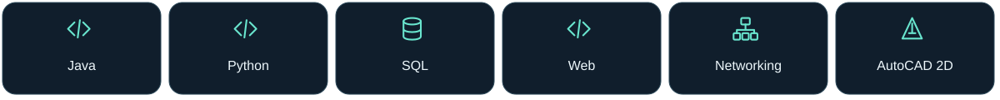
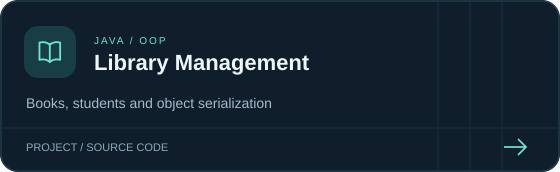
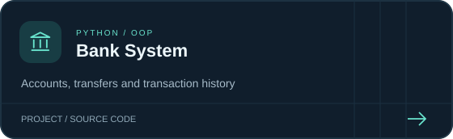
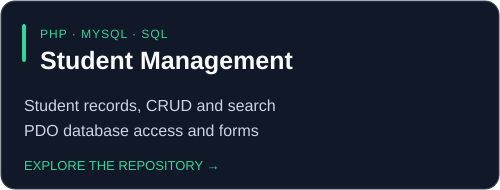
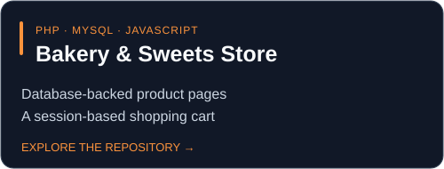
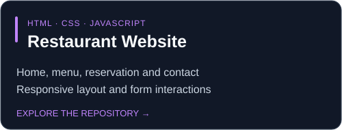
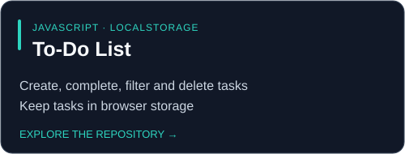

  

  
  
  

## 👋 About Me

I'm Adham. I build web interfaces, database applications and console systems to put what I learn into practice. My projects use **HTML, CSS, JavaScript, PHP, MySQL, Java and Python**. I also have hands-on experience with **SQL and networking projects**.

I like keeping my code clear, breaking a project into understandable parts, and learning by building something that works.

---

## 🧰 Tech Toolbox

| Focus | What I work with |
| --- | --- |
| **Web interfaces** | Semantic HTML, CSS layouts, responsive pages and JavaScript DOM interactions. |
| **Databases** | SQL, MySQL, PHP/PDO, CRUD operations and session-based data. |
| **OOP** | Java and Python classes, encapsulation, inheritance and method overriding; Java interfaces and abstract classes. |
| **Data storage** | MySQL, localStorage, Java object serialization and in-memory collections. |
| **Networking** | Practical networking projects and lab exercises. |

---

## 🚀 Featured Projects

Click a card to explore the code, setup instructions and project details.

| | |
| --- | --- |
|  |  |
|  |  |
|  |  |

---

## 💡 Project Highlights

- **Java Library:** organized books and students into classes, used interfaces and inheritance, and saved data to a local file.
- **Python Bank:** built account operations, transfers, transaction history and console menus with input checks.
- **PHP & MySQL:** worked with student records, product data, SQL queries and session-based shopping carts.
- **JavaScript:** handled calculator input, task filtering, browser storage and form interactions.
- **HTML & CSS:** built resume pages, landing pages, a portfolio and a multi-page restaurant website.

My project experience is documented in the linked repositories. SQL and networking are also part of my hands-on practice.

---

## 📈 GitHub Activity

[View my contribution graph and recent work on GitHub →](https://github.com/adhammr223-cyber?tab=overview#contributions)

---

<strong>Learn it. Build it. Understand it.</strong>

<a href="https://adhammr223-cyber.github.io/-Assignment-6-Adham-Muayad-Hashem_1320231720/">Portfolio</a> · <a href="https://github.com/adhammr223-cyber?tab=repositories">Explore all projects</a>

